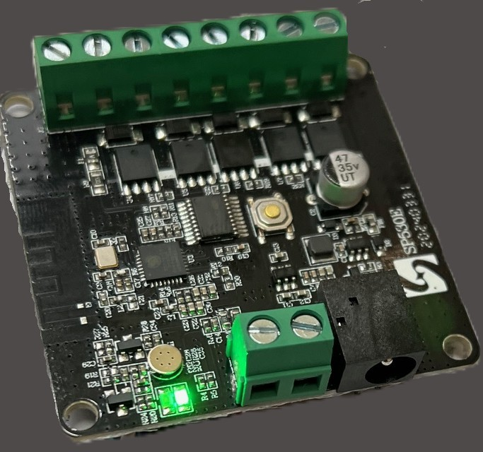
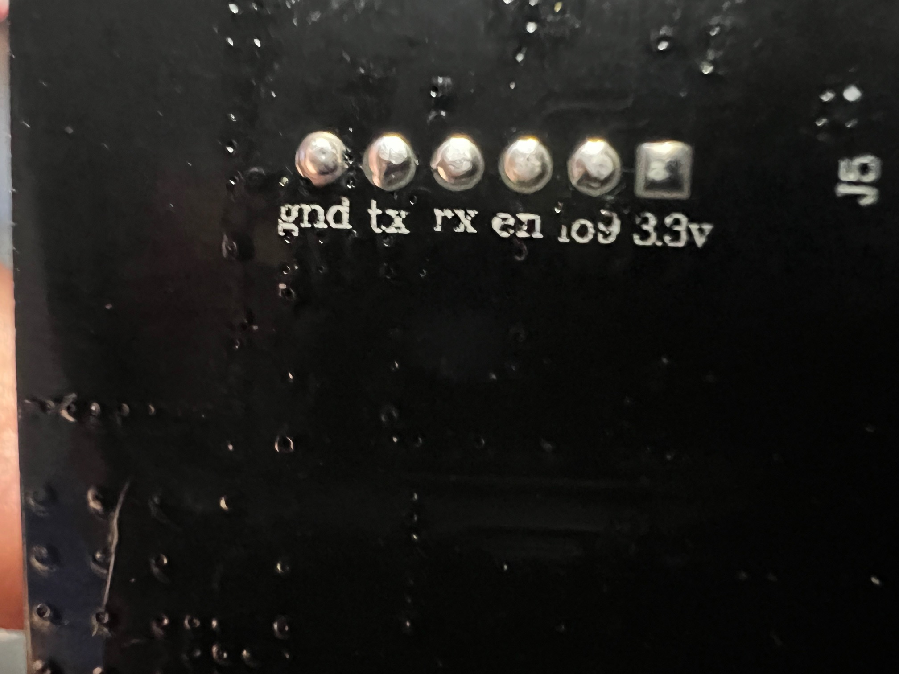
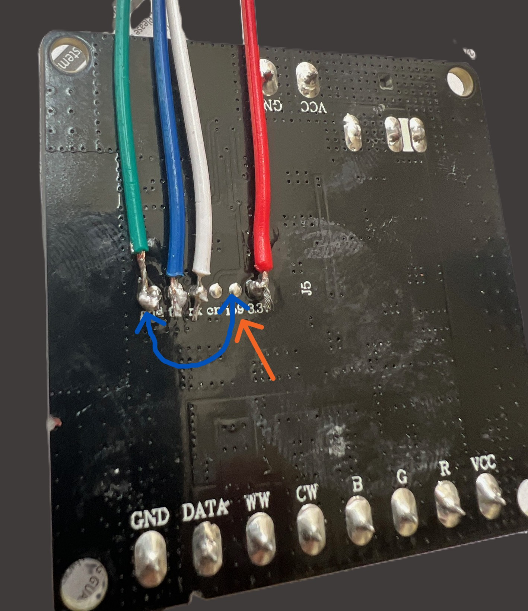
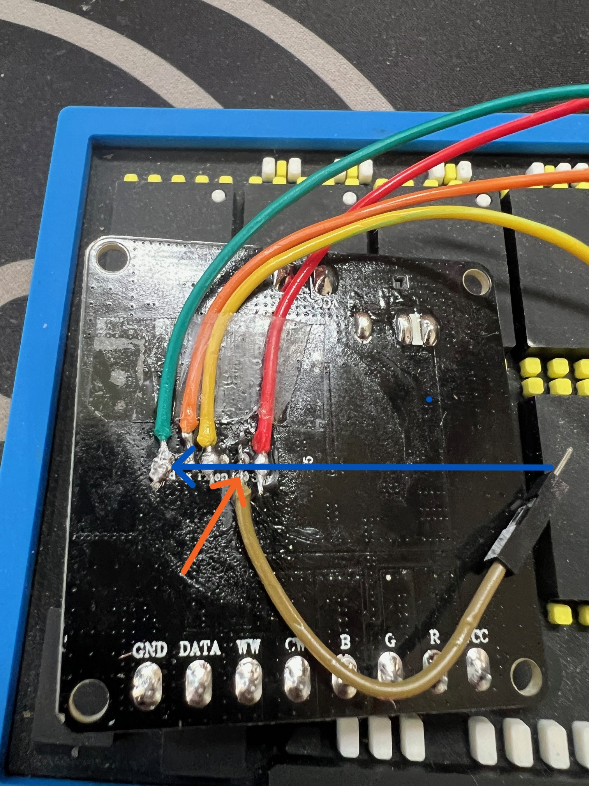
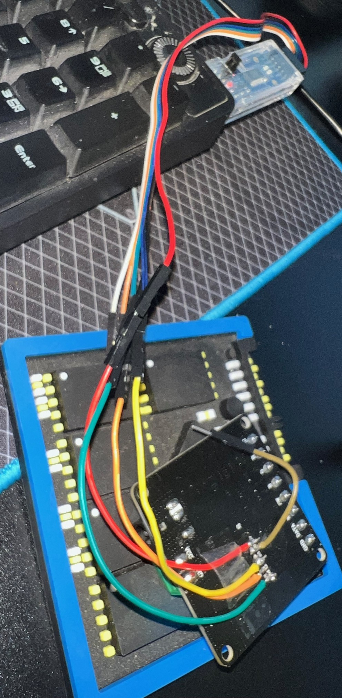

# SP530E firmware guide (user focused)

If you just want working firmware for SP530E, start here.

## Get the right file

1. Open releases: https://github.com/johnvoipguy/wled-custom-builds/releases
2. Pick the latest SP530E release asset.
3. Download one of these:
   - `wled-<version>-sp530e-<suffix>.app.bin` for OTA updates
   - `wled-<version>-sp530e-<suffix>.full.bin` for first-time UART flash

## Which file should I flash?

- Use `.app.bin` when your controller already runs WLED and OTA works.
- Use `.full.bin` when:
  - this is first install,
  - OTA fails,
  - device seems bricked,
  - partition layout changed.

## Flashing

### OTA (already running WLED)

1. Open WLED UI.
2. Go to Settings -> Security & Updates -> Manual OTA.
3. Upload the `.app.bin` file.

### UART / USB (first-time or recovery)

Example with esptool for ESP32-C3:

```sh
esptool.py --chip esp32c3 write_flash 0x0000 wled-<version>-sp530e-<suffix>.full.bin
```

If your setup needs an explicit port, add `--port <port>`.

## Troubleshooting

- Device does not boot after OTA:
  - Flash `.full.bin` over UART.
- Build flashes but hardware behavior is wrong:
  - Confirm you used SP530E target assets (not another board).
- Flash command fails with chip/connection errors:
  - Verify USB cable, boot mode, and that target chip is `esp32c3`.

## SP530E legacy hard-task archive

Main branch keeps modern target flow clean. Legacy SP530E branch-specific hack steps are intentionally moved out.

Use these pointers when you need old branch/hard-task procedures:

- SP530E v0.15.4 notes in this repo: [v0.15.4 notes](v0.15.4/notes.md)
- Historical package/apply flow (archived): https://github.com/johnvoipguy/wled-sp530e-mods/tree/main/sp530e_config_package
- Step-by-step legacy hard tasks: [targets/sp530e/LEGACY-HARD-TASKS.md](LEGACY-HARD-TASKS.md)

## Physical hacking photo examples

These images were restored from the historical `seeed-xiao` branch archive and kept here for SP530E hardware guidance.

 

  

## Source-of-truth config paths

- Shared target assets: [targets/sp530e/shared](shared)
- v15 line notes: [targets/sp530e/v15/notes.md](v15/notes.md)
- v16 line notes: [targets/sp530e/v16/notes.md](v16/notes.md)
