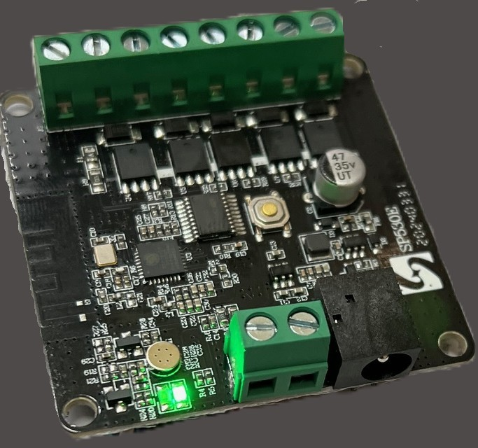
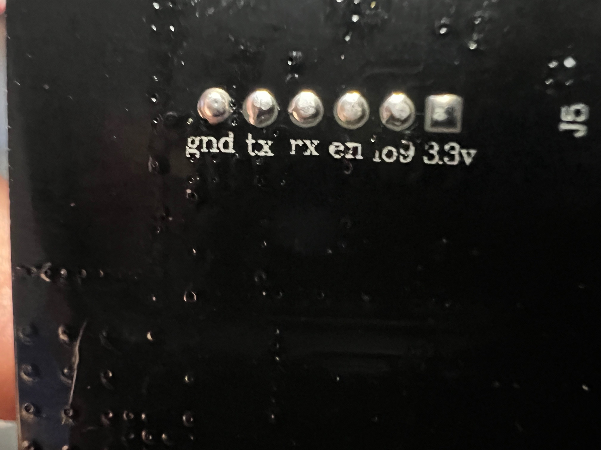
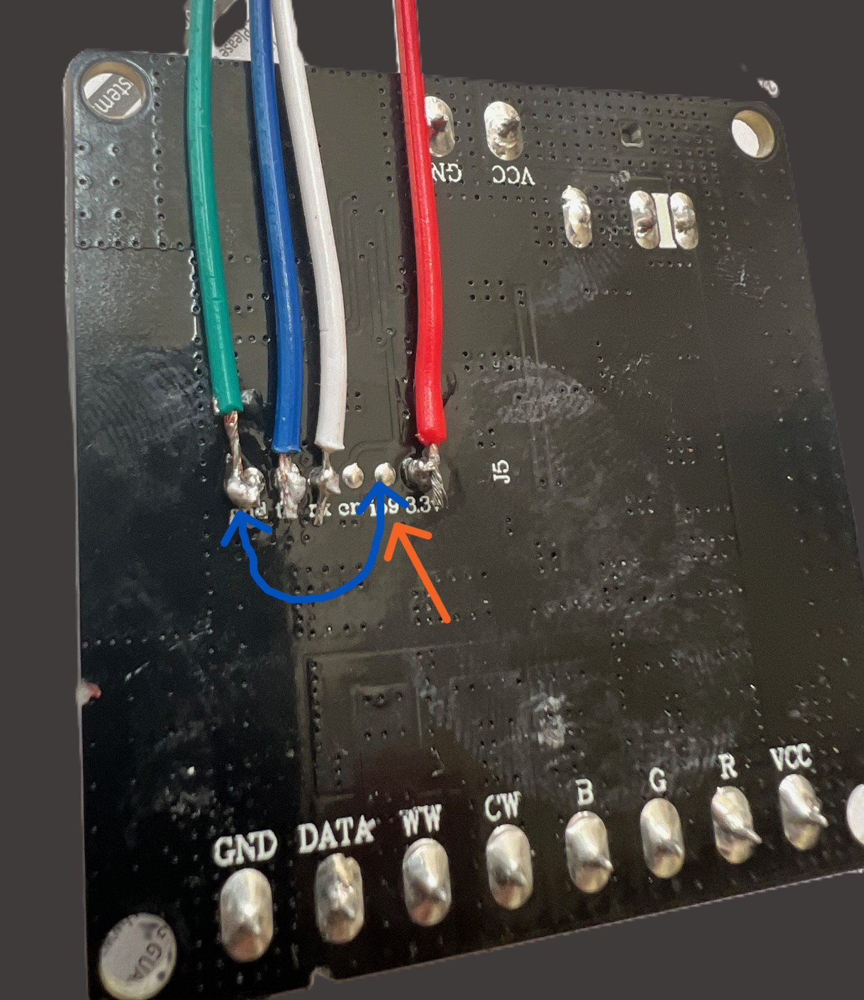
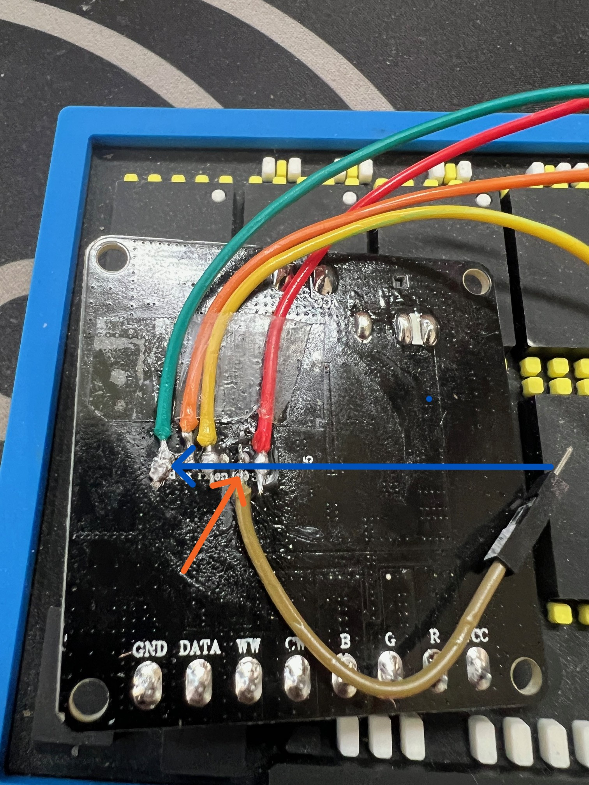
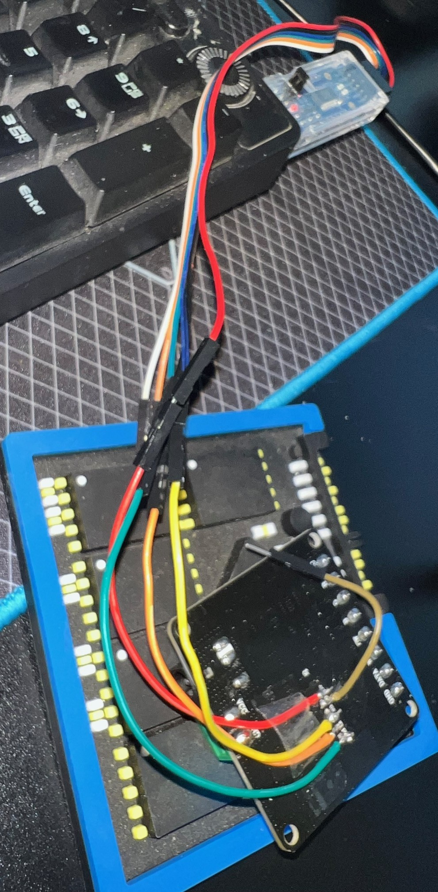

# SP530E firmware guide

If you just want working firmware for SP530E, start here.

## Get the right file

1. Open releases: https://github.com/johnvoipguy/wled-custom-builds/releases
2. Pick the latest SP530E release asset.
3. Download one of these:
   - `wled-<version>-sp530e-<suffix>.app.bin` for OTA updates
   - `wled-<version>-sp530e-<suffix>.full.bin` for first-time UART flash

## UART Wiring for SP530E

You need to solder wires to these points on the SP530E board:
- **TX** → UART RX
- **RX** → UART TX
- **GND** → UART GND
- **3.3V** → UART VCC (or use external 3.3V supply)
- When performing a firmware upload do not connect the device to AC but use the power supply provided by your (FTDI type) serial interface.
- GPIO9 → GND

 

**Put the device in firmware upload mode by grounding pin GPIO9 while applying power.**

  

**You'll know you did correctly, if after applying power and removing GPIO9 from GND if there are no lights on the front.**
### ESP32-C3 Optimizations
- **4MB Flash Support**: Optimized memory layout for ESP32-C3
- **GPIO Mapping**: Correct pin assignments for SP530E hardware
  - **On Board Button**: GPIO 8
  - **On Board Mic**: GPIO 3
  - **On Board Blue LED**: GPIO 0 (Inverted)
  - **On Board Green LED**: GPIO 1 (Inverted)
  - **LED Data Output**: GPIO 19
  - **Analog Pins**:
    - R: GPIO 10
    - G: GPIO 7
    - B: GPIO 6
    - WW: GPIO 5
    - CW: GPIO 4
- **Performance Tuning**: ESP32-C3 specific optimizations
- 
You can test connectivity by running:

```bash
esptool.py chip-id
```

If `chip-id` doesn't work, try different baud rates such as `-b 460800` or `-b 115200`.

Then copy original flash:

```bash
esptool -p PORT -b 460800 read-flash 0 ALL SP530E-Orig.bin
```

Optional:

```bash
esptool -p PORT erase-flash
```

## Which file should I flash?

- Use `.app.bin` when your controller already runs WLED and OTA works.
- Use `.full.bin` when:
  - this is first install,
  - OTA fails,
  - device seems bricked,
  - partition layout changed.

## Flashing

### OTA (already running WLED)

1. Open WLED UI.
2. Go to Settings -> Security & Updates -> Manual OTA.
3. Upload the `.app.bin` file.

### UART / USB (first-time or recovery)

Example with esptool for ESP32-C3:

```sh
esptool.py --chip esp32c3 --flash-mode dio write_flash --encrypt 0x0000 wled-<version>-sp530e-<suffix>.full.bin
```

If your setup needs an explicit port, add `--port <port>`.

> **Note:** The SP530E ships with Flash Encryption enabled in hardware (factory eFuse).
> The `--encrypt` flag is required to use the encrypted UART download path so that the
> ESP32-C3 hardware encrypts the data as it is written to flash — without it the bootloader
> cannot read the application and loops with `invalid header` errors. `--flash-mode dio` is
> also required because the 4 MB embedded XMC flash on ESP32-C3 uses DIO mode; using the
> default QIO produces the same `invalid header` symptom.

## Troubleshooting

- Device does not boot after OTA:
  - Flash `.full.bin` over UART.
- **Boot loop / `invalid header` after flashing `.full.bin`:**
  - The SP530E has Flash Encryption enabled in hardware (factory eFuse). Flashing
    without `--encrypt` means the data is transferred unencrypted over UART; the
    ESP32-C3 hardware therefore writes an unencrypted image to flash and the
    bootloader cannot read it, producing `invalid header: 0x...` on the serial console.
  - The 4 MB embedded XMC flash also requires DIO mode; using the default QIO produces
    the same symptom.
  - **Fix:** Re-flash using both `--flash-mode dio` and `--encrypt`:
    ```sh
    esptool.py --chip esp32c3 --flash-mode dio write_flash --encrypt 0x0000 wled-<version>-sp530e-<suffix>.full.bin
    ```
- Build flashes but hardware behavior is wrong:
  - Confirm you used SP530E target assets (not another board).
- Flash command fails with chip/connection errors:
  - Verify USB cable, boot mode, and that target chip is `esp32c3`.

## SP530E legacy hard-task archive

Main branch keeps modern target flow clean. Legacy SP530E branch-specific hack steps are intentionally moved out.

Use these pointers when you need old branch/hard-task procedures:

- SP530E v0.15.4 notes in this repo: [v0.15.4 notes](v0.15.4/notes.md)
- Historical package/apply flow (archived): https://github.com/johnvoipguy/wled-sp530e-mods/tree/main/sp530e_config_package
- Step-by-step legacy hard tasks: [targets/sp530e/LEGACY-HARD-TASKS.md](LEGACY-HARD-TASKS.md)

## Source-of-truth config paths

- Shared target assets: [targets/sp530e/shared](shared)
- v15 line notes: [targets/sp530e/v15/notes.md](v15/notes.md)
- v16 line notes: [targets/sp530e/v16/notes.md](v16/notes.md)
